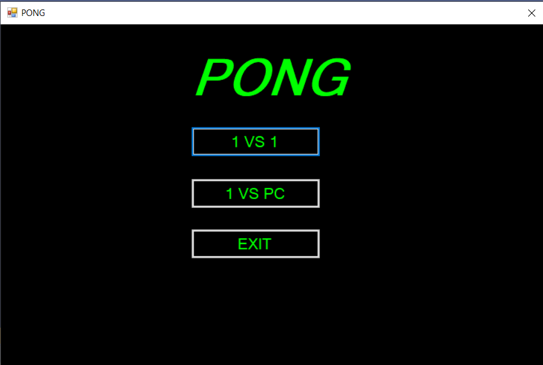
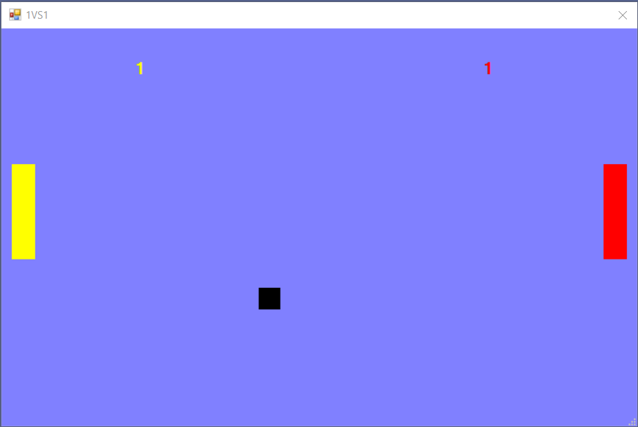
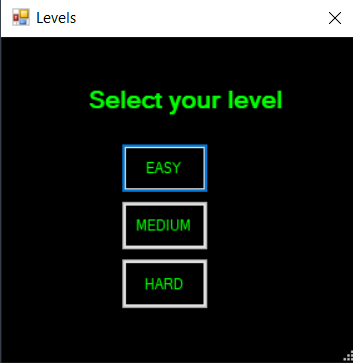
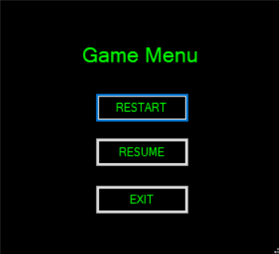

# <div align="center"> PONG </div>

## Description
It is my highschool's computer science certificate project. This PONG project has been implemented using only C#.

## Setup and Run
To set up and run the project locally on your machine, please follow the next steps:

### <i>Clone the repository</i>
Clone the repository using:
```
git clone https://github.com/Nathan-Augustinov/PONG.git
```
### <i>Open a command line session and run the project </i>
To actually run the project you need to open a command prompt and to go to the atestatpong/bin/Debug folder inside the recently cloned folder, where you have to run the atestatpong.exe file.

## How does the project look

If you followed all the above steps, you should be able to see an aplication starting, that looks like this:



As you see in the picture above, the game has two modes, 1 vs 1 and 1 vs PC. If you click on 1 vs 1 mode of play, your game should start and look like this:



The yellow player has to use the W and S keys to play, while the red player plays with the up and down arrow keys.

If you want to play against the PC, you need to click the 1 vs PC button, and then to select the level you want to play (easy, medium or hard).



The gameplay looks exactly the same as at 1 vs 1 mode of play and to play the game you have to use the up and down arrow keys.

If you want to pause the game you need to click the space key, when you should see the next pause menu, where you can restart, resume or exit the game.



## Credits
This project has been created by me and <a href="https://github.com/iliescumarius"> my highschool classmate </a>.

